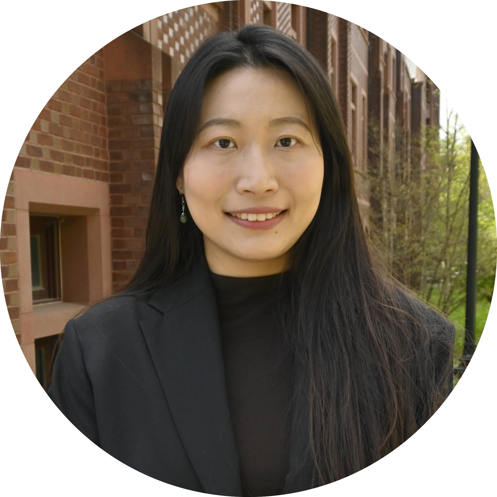

::: {.column-body}

:::

## Bhramar Mukherjee, Ph.D.

::: {style="float: left; margin-right: 20px;"}

:::

[](https://ysph.yale.edu/profile/bhramar-mukherjee/) 
[](mailto:bhramar.mukherjee@yale.edu) 
[](../content/cv/bhramar-mukherjee.pdf) 
[](https://scholar.google.com/citations?user=-zwWIG4AAAAJ&hl=en) 
[](https://x.com/BhramarBioStat) 
[](https://www.linkedin.com/in/bhramar-mukherjee-483810320/)

Professor Bhramar Mukherjee is the Anna M.R. Lauder Professor of Biostatistics and Professor of Chronic Disease Epidemiology at the Yale School of Public Health (YSPH). Professor Mukherjee serves as the inaugural Senior Associate Dean of Public Health Data Science and Data Equity at YSPH. She holds a secondary appointment in the Department of Statistics and Data Science and is affiliated with the MacMillan Center and the Institute for the Foundations of Data Science. She serves on the Yale Cancer Center Director’s cabinet.

 
 

## Jackson Higginbottom, M.P.H.

::: {style="float: left; margin-right: 20px;"}

:::

[](https://ysph.yale.edu/profile/jackson-higginbottom/)
[](mailto:jackson.higginbottom@yale.edu)
[](https://www.linkedin.com/in/jacksonhigg/)

Jackson Higginbottom, MPH, is a public health practitioner working at the intersection of data science, health communications, and community engagement. He's the Program Manager for the Public Health Data Science and Data Equity initiative at the Yale School of Public Health. His primary research interests include: (1) investigating the social determinants of mental and physical health among sexual, ethnic and racial minority populations; and (2) developing and evaluating evidence-based interventions to address health needs of under-resourced communities. In addition to his roles at Yale, Jackson is the President of Fundación Manos Juntas, a free medical clinic that provides care to over 3,000 patients in Oklahoma City.

 

## 	Cheng-Han Yang, Ph.D.

::: {style="float: left; margin-right: 20px;"}

:::

[](https://ysph.yale.edu/profile/cheng-han-yang/)
[](mailto:cheng-han.yang@yale.edu) 
[](../content/cv/cheng-han-yang.pdf) 
[](https://github.com/cyang728/) 
[](https://www.linkedin.com/in/cheng-han-yang-a18181205/)

I am an Associate Research Scientist in Biostatistics at Yale University, where I work with Dr. Bhramar Mukherjee. My research focuses on electronic health record (EHR) data analysis and the development of statistical methods for complex missing data problems in real-world health data. In particular, I study settings where missingness may be informative or missing not at random, such as when sicker patients return to the hospital more often and therefore have more frequent clinical measurements recorded. If these processes are ignored, analyses can lead to biased results and misleading scientific conclusions. My work aims to develop rigorous methods that account for these biases and improve valid inference from longitudinal EHR data. I received my PhD in Biostatistics and Data Science from the University of Texas Health Science Center at Houston in 2025. My broader methodological interests include survival analysis, causal inference, and Bayesian methods for clinical trial design. Within Yale’s Data Science and Data Equity community, I contribute through methodological research on EHR-based data science and missing data in complex clinical settings.

 

## 	Sean McGrath, Ph.D.

::: {style="float: left; margin-right: 20px;"}

:::

[](https://ysph.yale.edu/profile/sean-mcgrath/)
[](mailto:sean.mcgrath@yale.edu) 
[](../content/cv/sean-mcgrath.pdf)
[](https://stmcg.github.io/) 
[](https://github.com/stmcg) 
[](https://www.linkedin.com/in/sean-mcgrath-16b782141/)

Sean McGrath is a postdoctoral associate in the Department of Biostatistics at Yale School of Public Health. His research currently focuses on developing and applying causal inference methods, particularly in settings where data are integrated from multiple sources. Previously, he was a research fellow at Harvard Medical School and Harvard Pilgrim Health Care Institute. He completed a PhD in Biostatistics at Harvard University.

 

## 	Henan Xu, Ph.D.

::: {style="float: left; margin-right: 20px;"}

:::

[](https://ysph.yale.edu/profile/henan-xu/)
[](mailto:henan.xu@yale.edu) 
[](../content/cv/henan-xu.pdf)
[](https://www.linkedin.com/in/henan-xu/)

Henan Xu is a Postdoctoral Associate in the Department of Biostatistics at Yale School of Public Health. He received his PhD in Statistics from the University of Waterloo in 2026, after completing an MA in Statistics at Columbia University and a BSc in Mathematics and Statistics at the London School of Economics and Political Science. His research focuses on causal inference and statistical methodology, with particular interests in causal mediation analysis, longitudinal and functional data, and applications in health research. He has also been a Collaborating Research Trainee at Homewood Research Institute, where he contributes to collaborative mental health research.

 

## Shelby Golden, M.S.

::: {style="float: left; margin-right: 20px;"}

:::

[](https://ysph.yale.edu/profile/shelby-golden/)
[](mailto:shelby.golden@yale.edu)
[](../content/cv/shelby-golden.pdf)
[](https://github.com/sgolde13) 
[](https://www.linkedin.com/in/shelby-golden/)

Shelby Golden is a data scientist with a background in computational mathematics, molecular biology, and biochemistry. She holds a Master of Science in Applied Computational Mathematics from Johns Hopkins University and dual Bachelor of Science degrees in Molecular, Cellular, Developmental Biology and Biochemistry with a minor in Engineering in Applied Mathematics. Her expertise in both computational sciences and biology allows her to effectively bridge the gap between data and domain knowledge.
 

 

## Yiren Hou, M.S.

::: {style="float: left; margin-right: 20px;"}

:::

[](https://ysph.yale.edu/profile/yiren-hou/)
[](mailto:yiren.hou@yale.edu)
[](../content/cv/yiren-hou.pdf) 
[](www.linkedin.com/in/yiren-hou-79180618b)

Yiren Hou joined the team as a statistician in June 2025. She holds a Master of Science in Biostatistics from the University of Michigan and a Bachelor of Science in Statistics from the University of Georgia, where she also minored in Mathematics and Computer Science. At the Data Science and Data Equity Initiative, Yiren is responsible for applying appropriate statistical methods to support data-driven projects and research studies. Her academic training allows her to contribute effectively to the design, programming, execution, and analysis of studies.

&nbsp; &nbsp; &nbsp; &nbsp; &nbsp; &nbsp; &nbsp; &nbsp; &nbsp; &nbsp; &nbsp; &nbsp; &nbsp; &nbsp;

 

## Lillian Rountree, M.S.

::: {style="float: left; margin-right: 20px;"}

:::

[](mailto:lillian.rountree@yale.edu)
[](../content/cv/lillian-rountree.pdf)
[](https://www.linkedin.com/in/lillian-r-655456217/)

Lillian Rountree is a PhD student in the Department of Biostatistics at Yale. She joined the Mukherjee Lab in August 2023, when she began her masters at the University of Michigan. She also holds a Bachelors of Arts in Statistics and French from Columbia University. Her research interests include developing causal methods for infectious disease transmission and operationalizing data equity. In her other life, outside of research and academia, she is a fiction writer; in her free time beyond that, she loves literature, pop culture, and meandering walks.
   

 
 

## Youqi Yang

::: {style="float: left; margin-right: 20px;"}

:::

[](mailto:youqi@umich.edu)
[](../content/cv/youqi-yang.pdf)
[](https://www.linkedin.com/in/youqi-yang-a04636220/)

Youqi Yang is a second-year PhD candidate in Biostatistics at the University of Michigan, working under the mentorship of Dr. Bhramar Mukherjee and Dr. Walter Dempsey. His research focuses on causal inference, data integration, and survey analysis. In his free time, Youqi enjoys exploring pop culture, discovering great movies, and playing badminton. He also runs a "growing" food Instagram account with 24 followers.

## 	Waveley Qiu

::: {style="float: left; margin-right: 20px;"}

:::

[](mailto:waveley.qiu@yale.edu) 
[](../content/cv/waveley-qiu.pdf)
[](https://github.com/waveley)
[](https://www.linkedin.com/in/waveley/)

Waveley is a PhD student in the Department of Biostatistics at Yale, having begun in 2023 and joining the Mukherjee Lab in 2026. Prior to Yale, she received a MS in Biostatistics from Columbia University and a BS in Statistics from UCLA. She is interested in topics at the intersection of causal inference, real-world evidence, and drug discovery/development, motivated by her previous experience as a statistical programmer within the pharmaceutical industry. In her free time, Waveley enjoys reading good books and learning to make things from scratch – especially with others!

 

## Xingran Chen

::: {style="float: left; margin-right: 20px;"}

:::

[](https://chenxingran.com/) 
[](mailto:chenxran@umich.edu) 
[](../content/cv/xingran-chen.pdf)
[](	https://github.com/chenxran)
[](	https://www.linkedin.com/in/chenxran/)

Xingran joined the Mukherjee Lab in May 2024 and is a PhD student in Biostatistics at the University of Michigan. He is co-advised by Dr. Bhramar Mukherjee and Dr. Zhenke Wu. His research focus on missing data problems (e.g., prediction-based inference) and synthetic electronic health record generation. Outside of research, Xingran enjoys running, birding, and spending time in nature.

 
   
